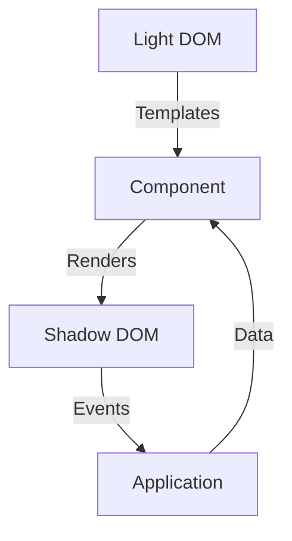
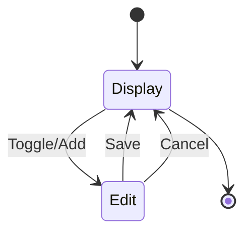
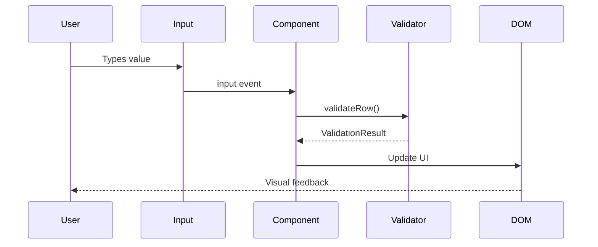

# Design Document: ck-editable-array Documentation Enhancement

## Overview

This document outlines the design for updating and enhancing all documentation and example files for the `ck-editable-array` web component. The goal is to ensure documentation accurately reflects the current implementation after the refactoring work, provides comprehensive usage guidance, and follows best practices for technical documentation.

### Current State Analysis

**Existing Documentation:**
- `docs/README.md` - User-facing documentation with API reference and examples
- `docs/readme.technical.md` - Technical implementation details
- `docs/spec.md` - Formal specification with acceptance criteria
- `docs/migration-guide.md` - Integration and migration guidance

**Existing Examples:**
- `examples/demo-comprehensive.html` - Multi-feature showcase
- `examples/demo-ac1.html` - Basic CRUD operations
- `examples/demo-validation.html` - Validation and accessibility focus

**Assessment:**
- Documentation is comprehensive and well-structured
- Examples are functional and demonstrate key features
- Content is mostly accurate but may need updates post-refactoring
- Some areas could benefit from additional detail or clarification

### Goals

1. **Accuracy**: Ensure all documentation reflects the current implementation
2. **Completeness**: Fill any gaps in API reference, examples, or guidance
3. **Clarity**: Improve readability and organization where needed
4. **Accessibility**: Enhance accessibility documentation and examples
5. **Usability**: Make it easier for developers to find and use information

### Non-Goals

- Changing the component's functionality or API
- Creating new documentation formats (e.g., JSDoc, TypeDoc)
- Building automated documentation generation
- Creating video tutorials or interactive playgrounds

## Architecture

### Documentation Structure

```
docs/
├── README.md                    # Primary user documentation
├── readme.technical.md          # Technical deep-dive
├── spec.md                      # Formal specification
├── migration-guide.md           # Integration guidance
├── quality-audit.md            # Quality assessment (existing)
└── enhancement-prompt.md       # Follow-up improvements (existing)

examples/
├── demo-comprehensive.html     # All features showcase
├── demo-ac1.html              # Basic CRUD
├── demo-validation.html       # Validation focus
└── demo-accessibility.html    # NEW: Accessibility focus
```

### Documentation Layers

**Layer 1: Quick Start (README.md)**
- Installation and basic setup
- Simple usage examples
- Common patterns
- Quick reference tables

**Layer 2: API Reference (README.md)**
- Attributes, properties, methods
- Events and their payloads
- Slots and templates
- CSS parts and styling hooks

**Layer 3: Technical Details (readme.technical.md)**
- Architecture and design decisions
- Internal data structures
- Rendering pipeline
- Performance considerations

**Layer 4: Specification (spec.md)**
- Formal requirements
- Acceptance criteria
- Event contracts
- Behavior specifications

**Layer 5: Integration (migration-guide.md)**
- Framework integration patterns
- Migration from alternatives
- Browser compatibility
- Troubleshooting

## Components and Interfaces

### Documentation Sections

#### 1. README.md Updates

**Current Sections:**
- Quick start
- Key features
- Behavior cheatsheet
- Validation
- Nested property support
- Soft delete & restore
- Events

**Proposed Updates:**
- ✅ Add "Installation" section at the top
- ✅ Add "Browser Support" section
- ✅ Expand "API Reference" with complete attribute/property list
- ✅ Add "Methods" section (if any public methods exist)
- ✅ Add "CSS Parts" section for styling
- ✅ Add "Troubleshooting" section
- ✅ Add "Performance Tips" section
- ✅ Improve code examples with more context

#### 2. readme.technical.md Updates

**Current Sections:**
- Data normalization
- Rendering pipeline
- Input wiring
- Events
- Validation system
- Data cloning & immutability

**Proposed Updates:**
- ✅ Add "Architecture Overview" diagram (Mermaid)
- ✅ Add "State Management" section
- ✅ Expand "Style Mirroring" explanation
- ✅ Add "Edit Mode Lifecycle" flowchart
- ✅ Add "Validation Flow" diagram
- ✅ Document internal constants and their purposes
- ✅ Add "Extension Points" for developers

#### 3. spec.md Updates

**Current Sections:**
- Multiple P-numbered specifications
- Event contracts
- Step-by-step feature specs

**Proposed Updates:**
- ✅ Add table of contents
- ✅ Group related specs into categories
- ✅ Add "Compliance Matrix" table
- ✅ Cross-reference with test files
- ✅ Add "Version History" section

#### 4. migration-guide.md Updates

**Current Sections:**
- New project integration
- Migrating from plain HTML forms
- Migrating from React/Vue
- Migrating from jQuery plugins
- Breaking changes
- Browser compatibility
- Polyfills

**Proposed Updates:**
- ✅ Add Angular integration example
- ✅ Add Svelte integration example
- ✅ Add "Form Submission" patterns
- ✅ Add "Server-Side Rendering" considerations
- ✅ Expand "Common Issues" section
- ✅ Add "Testing Strategies" section

### Example Files

#### 1. demo-comprehensive.html

**Current Features:**
- Basic CRUD
- Validation
- Nested properties
- Exclusive locking
- Custom styling
- Readonly mode

**Proposed Updates:**
- ✅ Add comments explaining each feature
- ✅ Add "View Source" toggle for code inspection
- ✅ Improve visual design and layout
- ✅ Add feature comparison table
- ✅ Add "Copy Code" buttons for snippets

#### 2. demo-ac1.html

**Current Features:**
- Default add button
- Custom add button
- Readonly mode

**Proposed Updates:**
- ✅ Add more inline comments
- ✅ Show form submission example
- ✅ Add data inspection panel
- ✅ Demonstrate name attribute behavior

#### 3. demo-validation.html

**Current Features:**
- Required fields
- Partial validation
- Add new item with validation

**Proposed Updates:**
- ✅ Add minLength validation example
- ✅ Add custom error messages
- ✅ Show validation schema variations
- ✅ Add "Test with Screen Reader" instructions

#### 4. NEW: demo-accessibility.html

**Purpose:** Dedicated accessibility demonstration

**Features:**
- Keyboard navigation walkthrough
- Screen reader announcements
- ARIA attribute inspection
- Focus management
- High contrast mode
- Reduced motion support

## Data Models

### Documentation Metadata

```typescript
interface DocumentSection {
  title: string;
  level: number; // Heading level (1-6)
  content: string;
  codeExamples?: CodeExample[];
  crossReferences?: string[];
}

interface CodeExample {
  language: string;
  code: string;
  description?: string;
  runnable: boolean;
}

interface APIReference {
  name: string;
  type: 'attribute' | 'property' | 'method' | 'event' | 'slot';
  signature?: string;
  description: string;
  examples: CodeExample[];
  since?: string;
  deprecated?: boolean;
}
```

### Example Metadata

```typescript
interface ExampleDemo {
  id: string;
  title: string;
  description: string;
  features: string[];
  difficulty: 'beginner' | 'intermediate' | 'advanced';
  codeSnippets: CodeSnippet[];
}

interface CodeSnippet {
  language: string;
  code: string;
  highlightLines?: number[];
  annotations?: Annotation[];
}

interface Annotation {
  line: number;
  text: string;
  type: 'info' | 'warning' | 'tip';
}
```

## Error Handling

### Documentation Quality Checks

**Automated Checks:**
- ✅ Broken links detection
- ✅ Code example syntax validation
- ✅ Consistent terminology usage
- ✅ Heading hierarchy validation
- ✅ Cross-reference validation

**Manual Review:**
- ✅ Technical accuracy against source code
- ✅ Example functionality verification
- ✅ Accessibility compliance
- ✅ Readability and clarity
- ✅ Completeness of coverage

### Example Quality Checks

**Automated Checks:**
- ✅ HTML validation
- ✅ JavaScript syntax validation
- ✅ CSS validation
- ✅ Accessibility audit (axe-core)
- ✅ Link integrity

**Manual Testing:**
- ✅ Visual inspection in multiple browsers
- ✅ Keyboard navigation testing
- ✅ Screen reader testing
- ✅ Mobile responsiveness
- ✅ Feature functionality

## Testing Strategy

### Documentation Testing

**Approach:**
1. **Code Example Verification**: Run all code examples to ensure they work
2. **Link Checking**: Verify all internal and external links
3. **Cross-Reference Validation**: Ensure all references point to existing content
4. **Terminology Consistency**: Check for consistent use of terms
5. **Completeness Check**: Verify all public APIs are documented

**Tools:**
- Markdown linters (markdownlint)
- Link checkers (markdown-link-check)
- Code syntax validators (ESLint for JS examples)
- Spell checkers (cspell)

### Example Testing

**Approach:**
1. **Functional Testing**: Verify all interactive features work
2. **Browser Testing**: Test in Chrome, Firefox, Safari, Edge
3. **Accessibility Testing**: Run axe-core and manual screen reader tests
4. **Mobile Testing**: Test on iOS and Android devices
5. **Performance Testing**: Ensure examples load quickly

**Tools:**
- Browser DevTools
- axe DevTools extension
- Lighthouse
- BrowserStack (for cross-browser testing)
- Screen readers (NVDA, JAWS, VoiceOver)

## Implementation Plan

### Phase 1: Documentation Audit

**Objective:** Identify gaps and inaccuracies

**Tasks:**
1. Read through all documentation files
2. Compare documentation against source code
3. Identify missing API documentation
4. List outdated or incorrect information
5. Note areas needing clarification
6. Create prioritized update list

**Deliverables:**
- Audit report with findings
- Prioritized list of updates

### Phase 2: README.md Updates

**Objective:** Update primary user documentation

**Tasks:**
1. Add installation section
2. Expand API reference with complete attribute/property list
3. Add CSS parts documentation
4. Add troubleshooting section
5. Add performance tips
6. Improve code examples
7. Add browser support section

**Deliverables:**
- Updated README.md

### Phase 3: Technical Documentation Updates

**Objective:** Enhance technical deep-dive documentation

**Tasks:**
1. Add architecture overview diagram
2. Add state management section
3. Expand style mirroring explanation
4. Add edit mode lifecycle flowchart
5. Add validation flow diagram
6. Document internal constants
7. Add extension points documentation

**Deliverables:**
- Updated readme.technical.md

### Phase 4: Specification Updates

**Objective:** Improve formal specification

**Tasks:**
1. Add table of contents
2. Group related specs into categories
3. Add compliance matrix table
4. Cross-reference with test files
5. Add version history section

**Deliverables:**
- Updated spec.md

### Phase 5: Migration Guide Updates

**Objective:** Enhance integration guidance

**Tasks:**
1. Add Angular integration example
2. Add Svelte integration example
3. Add form submission patterns
4. Add SSR considerations
5. Expand common issues section
6. Add testing strategies section

**Deliverables:**
- Updated migration-guide.md

### Phase 6: Example Enhancements

**Objective:** Improve existing examples

**Tasks:**
1. Add inline comments to demo-comprehensive.html
2. Improve visual design and layout
3. Add comments to demo-ac1.html
4. Show form submission example
5. Enhance demo-validation.html with more examples
6. Add screen reader testing instructions

**Deliverables:**
- Updated demo-comprehensive.html
- Updated demo-ac1.html
- Updated demo-validation.html

### Phase 7: New Accessibility Example

**Objective:** Create dedicated accessibility demo

**Tasks:**
1. Create demo-accessibility.html
2. Add keyboard navigation walkthrough
3. Add screen reader announcement examples
4. Add ARIA attribute inspection
5. Add focus management demonstration
6. Add high contrast mode example
7. Add reduced motion support

**Deliverables:**
- New demo-accessibility.html

### Phase 8: Quality Assurance

**Objective:** Verify all updates are accurate and complete

**Tasks:**
1. Run automated documentation checks
2. Verify all code examples work
3. Check all links
4. Test all examples in multiple browsers
5. Run accessibility audits
6. Conduct peer review
7. Fix any issues found

**Deliverables:**
- QA report
- All issues resolved

## Success Criteria

### Documentation Quality

- ✅ All public APIs are documented
- ✅ All code examples are tested and working
- ✅ No broken links
- ✅ Consistent terminology throughout
- ✅ Clear and concise writing
- ✅ Proper heading hierarchy
- ✅ Comprehensive troubleshooting section

### Example Quality

- ✅ All examples are functional
- ✅ Examples work in all supported browsers
- ✅ Examples pass accessibility audits
- ✅ Examples are well-commented
- ✅ Examples demonstrate best practices
- ✅ Examples are visually appealing
- ✅ Examples load quickly

### Completeness

- ✅ Installation instructions provided
- ✅ All attributes documented
- ✅ All properties documented
- ✅ All events documented
- ✅ All slots documented
- ✅ CSS parts documented
- ✅ Validation system fully explained
- ✅ Accessibility features documented
- ✅ Performance guidance provided
- ✅ Framework integration examples provided

### Usability

- ✅ Easy to find information
- ✅ Clear navigation structure
- ✅ Helpful code examples
- ✅ Practical troubleshooting guidance
- ✅ Accessible to developers of all skill levels

## Risks and Mitigation

| Risk | Likelihood | Impact | Mitigation |
|------|-----------|--------|------------|
| Documentation becomes outdated | Medium | High | Add version numbers and last updated dates |
| Code examples break with future changes | Medium | High | Include automated testing for examples |
| Inconsistent terminology | Low | Medium | Create glossary and use consistent terms |
| Missing edge cases | Medium | Medium | Review test files for edge case coverage |
| Accessibility documentation incomplete | Low | High | Conduct thorough accessibility audit |
| Examples don't work in all browsers | Low | Medium | Test in all supported browsers |

## Future Enhancements

While out of scope for this documentation update, the improved structure will enable:

1. **Interactive Documentation**: Live code editors for examples
2. **API Documentation Generator**: Automated docs from JSDoc comments
3. **Video Tutorials**: Screen recordings of common workflows
4. **Playground**: Online sandbox for experimentation
5. **Localization**: Translations for non-English speakers
6. **Version Comparison**: Side-by-side comparison of versions
7. **Search Functionality**: Full-text search across documentation

## Appendix

### Documentation Style Guide

**Headings:**
- Use sentence case for headings
- Use descriptive, action-oriented headings
- Maintain consistent heading hierarchy

**Code Examples:**
- Always include language hints in fenced code blocks
- Provide context before code examples
- Include comments for complex logic
- Show complete, runnable examples when possible

**Terminology:**
- Component (not "element" or "widget")
- Shadow DOM (not "shadow dom" or "shadowDOM")
- Light DOM (not "light dom" or "lightDOM")
- Row (not "item" or "entry")
- Edit mode (not "editing mode" or "edit state")

**Links:**
- Use descriptive link text (not "click here")
- Prefer relative links for internal documentation
- Include external link indicators where appropriate

### Mermaid Diagram Examples

**Architecture Overview:**


**Edit Mode Lifecycle:**


**Validation Flow:**

