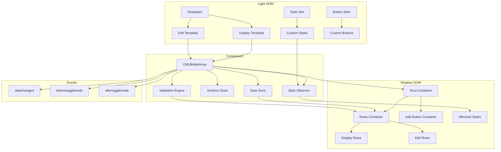
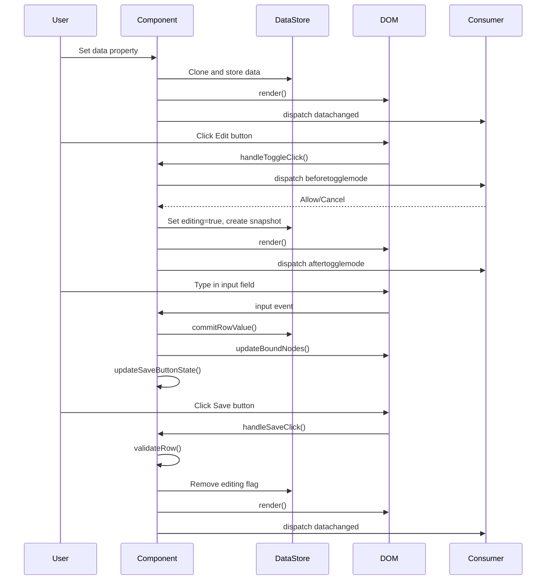
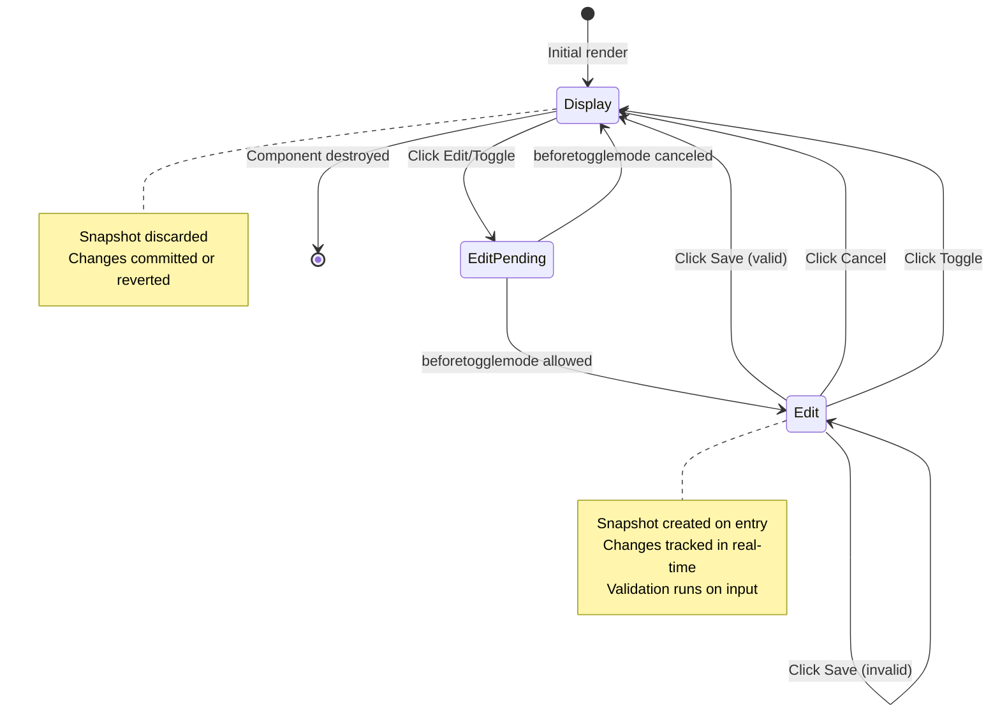
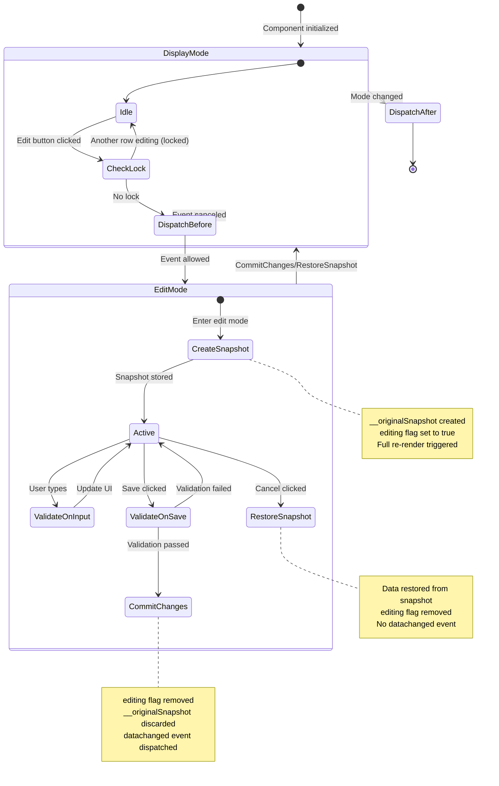
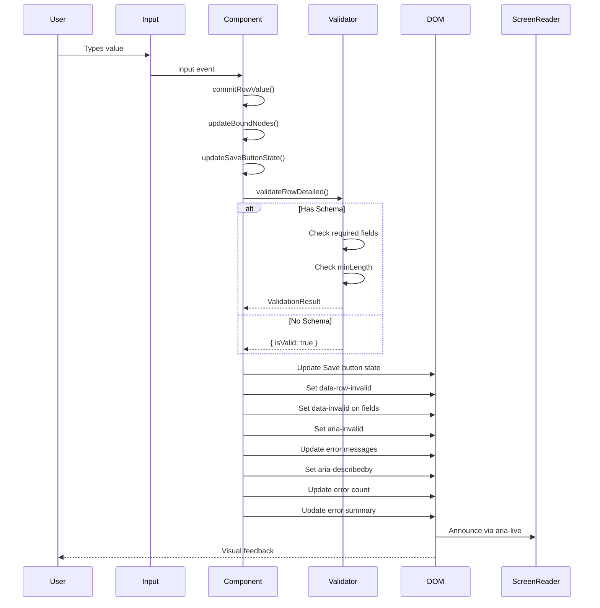

# Technical notes: ck-editable-array

## Architecture Overview

The `ck-editable-array` component follows a Shadow DOM-based architecture with template-driven rendering and reactive data binding.



**Key Architectural Principles:**

1. **Shadow DOM Encapsulation**: Component internals are isolated from the page, preventing style leakage
2. **Template-Driven Rendering**: User-provided templates define row structure, component handles data binding
3. **Immutable Data Flow**: All data operations create new copies, preventing external mutations
4. **Event-Driven Communication**: Component communicates state changes via custom events
5. **Progressive Enhancement**: Works with or without validation schema, custom buttons, or styling

## State Management

### Internal State Properties

The component maintains several internal state properties:

- **`_data: EditableRow[]`**: The primary data store containing all row data with internal markers
- **`_schema: unknown`**: Validation schema (JSON Schema-like format)
- **`_newItemFactory: () => EditableRow`**: Factory function for creating new rows
- **`_styleObserver: MutationObserver | null`**: Observer for tracking style changes in light DOM

### Data Flow and State Transitions



### State Transitions

**Row Mode States:**
- **Display Mode**: Default state, shows read-only view of data
- **Edit Mode**: Editable state with input fields and Save/Cancel buttons
- **Locked Mode**: Display mode when another row is being edited (exclusive locking)
- **Deleted Mode**: Soft-deleted state with visual indicators and Restore option

**Edit Mode Lifecycle:**



### Internal Data Markers

The component uses internal properties to track state:

- **`editing: boolean`**: Indicates row is in edit mode
- **`deleted: boolean`**: Indicates row is soft-deleted
- **`__originalSnapshot: Record<string, unknown>`**: Snapshot of data before editing (for Cancel/rollback)
- **`__isNew: boolean`**: Marks newly added rows (removed on Cancel instead of restored)

These markers are filtered out when data is exposed via the public `data` getter.

## Architecture Overview

The `ck-editable-array` component follows a Shadow DOM-based architecture with template-driven rendering and reactive data binding.


**Key Architectural Principles:**

1. **Shadow DOM Encapsulation**: Component internals are isolated from the page, preventing style leakage
2. **Template-Driven Rendering**: User-provided templates define row structure, component handles data binding
3. **Immutable Data Flow**: All data operations create new copies, preventing external mutations
4. **Event-Driven Communication**: Component communicates state changes via custom events
5. **Progressive Enhancement**: Works with or without validation schema, custom buttons, or styling

## State Management

### Internal State Properties

The component maintains several internal state properties:

- **`_data: EditableRow[]`**: The primary data store containing all row data with internal markers
- **`_schema: unknown`**: Validation schema (JSON Schema-like format)
- **`_newItemFactory: () => EditableRow`**: Factory function for creating new rows
- **`_styleObserver: MutationObserver | null`**: Observer for tracking style changes in light DOM

### Data Flow and State Transitions


### State Transitions

**Row Mode States:**
- **Display Mode**: Default state, shows read-only view of data
- **Edit Mode**: Editable state with input fields and Save/Cancel buttons
- **Locked Mode**: Display mode when another row is being edited (exclusive locking)
- **Deleted Mode**: Soft-deleted state with visual indicators and Restore option

**Edit Mode Lifecycle:**


### Internal Data Markers

The component uses internal properties to track state:

- **`editing: boolean`**: Indicates row is in edit mode
- **`deleted: boolean`**: Indicates row is soft-deleted
- **`__originalSnapshot: Record<string, unknown>`**: Snapshot of data before editing (for Cancel/rollback)
- **`__isNew: boolean`**: Marks newly added rows (removed on Cancel instead of restored)

These markers are filtered out when data is exposed via the public `data` getter.

## Data normalization
- `data` setter clones incoming arrays.
- Object rows become shallow copies so edits do not mutate the original reference.
- Primitive rows (string/number/boolean) are stored as strings; falsy values default to an empty string.

## Rendering pipeline
- A shadow `div[part="root"]` is cleared and repopulated on every `render()`.
- Templates in the light DOM are cloned per row with `data-row`/`data-mode` markers.
- `[data-bind]` nodes receive either `textContent` (display) or `value` (inputs/textarea) populated via `resolveBindingValue`.

### Radio Group Binding Internals

Radio inputs pose a special case because multiple `input[type="radio"]` elements represent a single logical field. The binding logic handles them explicitly:

1. During `bindDataToNode`, if a bound node is a radio input the component compares `node.value` (the option value) to the resolved field value. It sets `node.checked = (node.value === fieldValue)` and an `aria-checked` attribute for assistive tech.
2. Radio inputs are not assigned new `value` strings (avoids overwriting option semantics).
3. Event wiring uses `change` instead of `input` to ensure reliable updates in all browsers and JSDOM. Only a checked radio commits its value.
4. Name attribute grouping: If the component has a `name` attribute, each radio in a row receives `name="{componentName}[rowIndex].{field}"` assuring exclusivity per row. Without a name attribute radios still function independently; setting the name is recommended for form submissions.
5. Saving a row after radio selection triggers the standard validation + `datachanged` flow (radio selections are treated like any other field edits).

Edge Cases Considered:
- Absence of name attribute: radios act independently but still reflect checked state correctly.
- Switching value while still in edit mode: change events update internal `_data` but do not dispatch `datachanged` until Save, preserving pre-save semantics.
- Programmatic data changes to `data[row].field` while in edit mode (future enhancement): current implementation would require manual re-render; optimization hooks could be added later.


### Edit Mode Lifecycle

The component implements a sophisticated edit mode lifecycle with snapshot-based rollback:



**Key Behaviors:**

1. **Exclusive Locking**: Only one row can be in edit mode at a time
2. **Snapshot Creation**: Original data is cloned when entering edit mode
3. **Real-time Validation**: Validation runs on every input change
4. **Cancelable Transitions**: `beforetogglemode` event allows external control
5. **Rollback Support**: Cancel restores data from snapshot without data change event

## Input wiring
- Only elements inside the `slot="edit"` clone get listeners.
- Inputs and textareas subscribe to `input` events and call `commitRowValue(rowIndex, key, value)` which snapshots `_data`, applies the change, re-renders, and emits `datachanged` once per logical edit.

## Style Mirroring

The component implements a sophisticated style mirroring system to allow custom styling within the Shadow DOM while maintaining encapsulation.

### MutationObserver Implementation

**Purpose**: Automatically sync styles from light DOM to shadow DOM when they change.

**How it works:**

1. **Initial Mirror** (`mirrorStyles()`):
   - Finds all `<style slot="styles">` elements in light DOM
   - Combines their content into a single string
   - Creates a `<style data-mirrored="true">` element in shadow DOM
   - Inserts at the beginning of shadow root for proper cascade order

2. **Change Detection** (`observeStyleChanges()`):
   - Creates a `MutationObserver` watching the component's light DOM
   - Monitors three types of mutations:
     - **childList**: Detects added/removed `<style>` elements
     - **characterData**: Detects text content changes within `<style>` elements
     - **subtree**: Watches all descendants for nested changes

3. **Selective Re-mirroring**:
   - Observer callback checks if mutation involves style elements via `isStyleMutation()`
   - Only re-mirrors when style-related changes detected (performance optimization)
   - Removes old mirrored styles before creating new ones

**Mutation Detection Logic:**

```typescript
// Check if mutation target is a style element
if (mutation.type === 'childList' && this.isStyleNode(mutation.target)) {
  return true;
}

// Check if any added/removed nodes are style elements
if (mutation.type === 'childList') {
  const hasStyleChanges =
    Array.from(mutation.addedNodes).some(node => this.isStyleNode(node)) ||
    Array.from(mutation.removedNodes).some(node => this.isStyleNode(node));
  if (hasStyleChanges) return true;
}

// Check if text content of a style element changed
if (mutation.type === 'characterData' &&
    mutation.target.parentElement &&
    this.isStyleNode(mutation.target.parentElement)) {
  return true;
}
```

**Lifecycle Management:**

- Observer created in `connectedCallback()`
- Observer disconnected in `disconnectedCallback()` to prevent memory leaks
- Observer recreated if component is reconnected to DOM

**Performance Considerations:**

- Single combined `<style>` element reduces DOM nodes
- Selective re-mirroring avoids unnecessary work
- Empty or whitespace-only styles are skipped
- Observer only triggers on actual style changes, not all DOM mutations

## Style Mirroring

The component implements a sophisticated style mirroring system to allow custom styling within the Shadow DOM while maintaining encapsulation.

### MutationObserver Implementation

**Purpose**: Automatically sync styles from light DOM to shadow DOM when they change.

**How it works:**

1. **Initial Mirror** (`mirrorStyles()`):
   - Finds all `<style slot="styles">` elements in light DOM
   - Combines their content into a single string
   - Creates a `<style data-mirrored="true">` element in shadow DOM
   - Inserts at the beginning of shadow root for proper cascade order

2. **Change Detection** (`observeStyleChanges()`):
   - Creates a `MutationObserver` watching the component's light DOM
   - Monitors three types of mutations:
     - **childList**: Detects added/removed `<style>` elements
     - **characterData**: Detects text content changes within `<style>` elements
     - **subtree**: Watches all descendants for nested changes

3. **Selective Re-mirroring**:
   - Observer callback checks if mutation involves style elements via `isStyleMutation()`
   - Only re-mirrors when style-related changes detected (performance optimization)
   - Removes old mirrored styles before creating new ones

**Mutation Detection Logic:**

```typescript
// Check if mutation target is a style element
if (mutation.type === 'childList' && this.isStyleNode(mutation.target)) {
  return true;
}

// Check if any added/removed nodes are style elements
if (mutation.type === 'childList') {
  const hasStyleChanges =
    Array.from(mutation.addedNodes).some(node => this.isStyleNode(node)) ||
    Array.from(mutation.removedNodes).some(node => this.isStyleNode(node));
  if (hasStyleChanges) return true;
}

// Check if text content of a style element changed
if (mutation.type === 'characterData' &&
    mutation.target.parentElement &&
    this.isStyleNode(mutation.target.parentElement)) {
  return true;
}
```

**Lifecycle Management:**

- Observer created in `connectedCallback()`
- Observer disconnected in `disconnectedCallback()` to prevent memory leaks
- Observer recreated if component is reconnected to DOM

**Performance Considerations:**

- Single combined `<style>` element reduces DOM nodes
- Selective re-mirroring avoids unnecessary work
- Empty or whitespace-only styles are skipped
- Observer only triggers on actual style changes, not all DOM mutations

## Events

### Event Configuration

All events are dispatched with `bubbles: true` and `composed: true` to ensure proper propagation through shadow DOM boundaries.

#### datachanged Event
```typescript
new CustomEvent('datachanged', {
  bubbles: true,
  composed: true,
  detail: { data: this.data }  // Fresh clone from getter
});
```

**Dispatched when**:
- Data setter is called
- User edits a field (via `commitRowValue`)
- Save button is clicked
- Add button is clicked
- Delete button is clicked
- Restore button is clicked
- Toggle mode changes data (adds/removes `editing` flag)

**Behavior**:
- Bubbles up the DOM tree to ancestor elements
- Crosses shadow DOM boundaries (composed)
- `detail.data` contains a fresh clone from the getter
- Consumers cannot mutate internal state via event data

#### beforetogglemode Event
```typescript
new CustomEvent('beforetogglemode', {
  bubbles: true,
  composed: true,
  cancelable: true,
  detail: {
    index: number,
    from: 'display' | 'edit',
    to: 'display' | 'edit'
  }
});
```

**Dispatched when**:
- Toggle button is clicked (before mode change)
- Cancel button is clicked (before reverting to display)

**Behavior**:
- Cancelable - calling `event.preventDefault()` prevents the mode toggle
- Bubbles to ancestor elements
- Crosses shadow DOM boundaries
- Allows external control over edit mode transitions

#### aftertogglemode Event
```typescript
new CustomEvent('aftertogglemode', {
  bubbles: true,
  composed: true,
  detail: {
    index: number,
    mode: 'display' | 'edit'
  }
});
```

**Dispatched when**:
- Mode toggle completes successfully
- After Cancel button reverts to display mode

**Behavior**:
- Not cancelable (mode change already completed)
- Bubbles to ancestor elements
- Crosses shadow DOM boundaries
- Notifies of completed mode transitions

### Event Propagation

**Shadow DOM Boundaries**:
- All events use `composed: true` to cross shadow boundaries
- Events can be caught on ancestor elements (e.g., `document.body`)
- Events can be caught at document level
- `event.target` is always the `<ck-editable-array>` element

**Event Delegation**:
```javascript
// Listen on parent element
document.body.addEventListener('datachanged', (event) => {
  console.log('Data changed:', event.detail.data);
});

// Cancel mode toggle for specific rows
el.addEventListener('beforetogglemode', (event) => {
  if (event.detail.index === 0) {
    event.preventDefault(); // Prevent row 0 from toggling
  }
});

// React to completed mode changes
el.addEventListener('aftertogglemode', (event) => {
  console.log(`Row ${event.detail.index} is now in ${event.detail.mode} mode`);
});
```

### Event Payload Consistency & Immutability

**datachanged Event Payload**:
- `detail.data` always contains the **complete current array**
- The array is a fresh clone from the `data` getter (deep clone via JSON)
- Mutating `event.detail.data` does NOT affect the component's internal state
- Consumers receive the full state, not just changed items
- This simplifies state synchronization with external stores

**beforetogglemode Event Payload**:
- `detail.index`: The row index being toggled
- `detail.from`: Current mode before transition (`'display'` or `'edit'`)
- `detail.to`: Target mode after transition (`'display'` or `'edit'`)
- Provides complete transition context for conditional prevention
- Useful for validation, authorization, or state checks

**aftertogglemode Event Payload**:
- `detail.index`: The row index that toggled
- `detail.mode`: Final mode after transition (`'display'` or `'edit'`)
- Does NOT include `from`/`to` since transition is complete
- Useful for post-transition side effects (focus, analytics, etc.)

**Immutability Guarantees**:
```javascript
// Example: datachanged payload is immutable
el.addEventListener('datachanged', (event) => {
  const data = event.detail.data;
  
  // Safe to mutate - won't affect component
  data[0].name = 'Modified';
  
  // Reading el.data again returns original value
  console.log(el.data[0].name); // Still original value
  
  // To update component, must reassign
  el.data = data; // Now component updates
});
```

**No Initial Spam**:
- No events dispatched during initial render
- Events only describe user interactions and programmatic data changes
- Setting `data` property dispatches one `datachanged` event


## Validation System

### Schema Storage and Validation
- `schema` property stores validation rules (JSON Schema-like format)
- `validateRow(rowIndex)` returns boolean validity
- `validateRowDetailed(rowIndex)` returns `{ isValid: boolean, errors: Record<string, string[]> }`
- Validation runs on:
  - Row toggle to edit mode
  - Input field changes (via `input` event)
  - Save button click

### Validation Rules
Currently supports:
- **Required fields**: `schema.required` array lists mandatory fields
- **String minLength**: `schema.properties[field].minLength` enforces minimum length
- Empty string, null, undefined, and whitespace-only values fail required validation

### Validation UI Updates
`updateSaveButtonState(rowIndex)` orchestrates all validation UI:

1. **Save Button State**
   - Disabled when `isValid === false`
   - `aria-disabled="true"` added for accessibility

2. **Row-level Indicators**
   - `data-row-invalid` attribute on edit wrapper when invalid
   - Removed when all fields pass validation

3. **Field-level Indicators**
   - `data-invalid` attribute on invalid inputs
   - `aria-invalid="true"` for screen reader support
   - Removed when field becomes valid

4. **Error Messages**
   - Elements with `data-field-error="fieldName"` receive error text
   - Cleared when field becomes valid
   - Unique IDs generated: `error-{rowIndex}-{fieldName}`
   - Linked to inputs via `aria-describedby`

5. **Error Count**
   - Elements with `data-error-count` show "N error(s)"
   - Cleared when valid

6. **Error Summary**
   - Elements with `data-error-summary` receive concatenated error messages
   - Format: "field1 is required. field2 must be at least N characters."
   - Cleared when valid
   - Should include `role="alert"` and `aria-live="polite"` in template

### Accessibility Implementation

**ARIA Attributes**:
- `aria-invalid="true"` marks invalid fields
- `aria-describedby` links inputs to error messages
- `role="alert"` on error summary for immediate announcement
- `aria-live="polite"` on error summary for dynamic updates

**ID Generation**:
- Error message IDs: `error-{rowIndex}-{fieldName}`
- Ensures uniqueness across multiple rows
- Stable IDs for ARIA relationships

**Screen Reader Flow**:
1. User focuses invalid input
2. Screen reader announces field label
3. Screen reader announces `aria-invalid` state
4. Screen reader reads error message via `aria-describedby`
5. Error summary announces changes via `aria-live`

### Validation Data Flow



**Validation Trigger Points:**

1. **On Input Change**: Real-time validation as user types
2. **On Save Click**: Final validation before committing changes
3. **On Mode Toggle**: Validation when entering edit mode

**UI Update Sequence:**

1. Save button disabled state updated
2. Row-level `data-row-invalid` attribute set/removed
3. Field-level `data-invalid` attributes updated
4. ARIA `aria-invalid` attributes synchronized
5. Error message text populated
6. ARIA `aria-describedby` relationships established
7. Error count display updated
8. Error summary updated (triggers screen reader announcement)


**Validation Trigger Points:**

1. **On Input Change**: Real-time validation as user types
2. **On Save Click**: Final validation before committing changes
3. **On Mode Toggle**: Validation when entering edit mode

**UI Update Sequence:**

1. Save button disabled state updated
2. Row-level `data-row-invalid` attribute set/removed
3. Field-level `data-invalid` attributes updated
4. ARIA `aria-invalid` attributes synchronized
5. Error message text populated
6. ARIA `aria-describedby` relationships established
7. Error count display updated
8. Error summary updated (triggers screen reader announcement)

### Performance Considerations
- Validation runs synchronously on input change
- Only validates the specific row being edited
- DOM updates are targeted (no full re-render)
- Error message IDs are generated once and reused
- ARIA attributes updated only when validation state changes


## Internal Constants

The component defines several internal constants for consistency and maintainability:

### Shadow DOM Parts

- **`PART_ROOT = 'root'`**: Main container in shadow DOM
- **`PART_ROWS = 'rows'`**: Container for all row elements
- **`PART_ADD_BUTTON = 'add-button'`**: Container for add button

**Usage**: These parts are exposed for external styling via CSS `::part()` selector:
```css
ck-editable-array::part(root) { /* styles */ }
ck-editable-array::part(rows) { /* styles */ }
ck-editable-array::part(add-button) { /* styles */ }
```

### Slot Names

- **`SLOT_STYLES = 'styles'`**: Slot for custom style elements
- **`SLOT_DISPLAY = 'display'`**: Slot for display mode template
- **`SLOT_EDIT = 'edit'`**: Slot for edit mode template

**Usage**: Templates and styles must use these slot names:
```html
<style slot="styles">/* custom styles */</style>
<template slot="display"><!-- display template --></template>
<template slot="edit"><!-- edit template --></template>
```

### Data Attributes

- **`ATTR_DATA_BIND = 'data-bind'`**: Marks elements for data binding
- **`ATTR_DATA_ACTION = 'data-action'`**: Identifies button actions (add, save, cancel, toggle, delete, restore)
- **`ATTR_DATA_ROW = 'data-row'`**: Stores row index on rendered elements
- **`ATTR_DATA_MODE = 'data-mode'`**: Stores rendering mode ('display' or 'edit')

**Usage**: These attributes enable data binding and event handling:
```html
<span data-bind="name"></span>
<input data-bind="email" />
<button data-action="save">Save</button>
```

### CSS Classes

- **`CLASS_HIDDEN = 'hidden'`**: Hides elements (display: none !important)
- **`CLASS_DELETED = 'deleted'`**: Marks deleted rows for styling
- **`CLASS_DISPLAY_CONTENT = 'display-content'`**: Wrapper class for display mode rows
- **`CLASS_EDIT_CONTENT = 'edit-content'`**: Wrapper class for edit mode rows

**Usage**: These classes control visibility and provide styling hooks:
```css
.display-content.deleted { opacity: 0.5; }
.edit-content[data-row-invalid] { border: 2px solid red; }
```

### Purpose and Benefits

1. **Consistency**: Single source of truth for all string constants
2. **Maintainability**: Easy to update attribute/class names in one place
3. **Type Safety**: TypeScript ensures correct usage throughout codebase
4. **Refactoring**: IDE can safely rename constants without breaking functionality
5. **Documentation**: Constants serve as self-documenting code

## Internal Constants

The component defines several internal constants for consistency and maintainability:

### Shadow DOM Parts

- **`PART_ROOT = 'root'`**: Main container in shadow DOM
- **`PART_ROWS = 'rows'`**: Container for all row elements
- **`PART_ADD_BUTTON = 'add-button'`**: Container for add button

**Usage**: These parts are exposed for external styling via CSS `::part()` selector:
```css
ck-editable-array::part(root) { /* styles */ }
ck-editable-array::part(rows) { /* styles */ }
ck-editable-array::part(add-button) { /* styles */ }
```

### Slot Names

- **`SLOT_STYLES = 'styles'`**: Slot for custom style elements
- **`SLOT_DISPLAY = 'display'`**: Slot for display mode template
- **`SLOT_EDIT = 'edit'`**: Slot for edit mode template

**Usage**: Templates and styles must use these slot names:
```html
<style slot="styles">/* custom styles */</style>
<template slot="display"><!-- display template --></template>
<template slot="edit"><!-- edit template --></template>
```

### Data Attributes

- **`ATTR_DATA_BIND = 'data-bind'`**: Marks elements for data binding
- **`ATTR_DATA_ACTION = 'data-action'`**: Identifies button actions (add, save, cancel, toggle, delete, restore)
- **`ATTR_DATA_ROW = 'data-row'`**: Stores row index on rendered elements
- **`ATTR_DATA_MODE = 'data-mode'`**: Stores rendering mode ('display' or 'edit')

**Usage**: These attributes enable data binding and event handling:
```html
<span data-bind="name"></span>
<input data-bind="email" />
<button data-action="save">Save</button>
```

### CSS Classes

- **`CLASS_HIDDEN = 'hidden'`**: Hides elements (display: none !important)
- **`CLASS_DELETED = 'deleted'`**: Marks deleted rows for styling
- **`CLASS_DISPLAY_CONTENT = 'display-content'`**: Wrapper class for display mode rows
- **`CLASS_EDIT_CONTENT = 'edit-content'`**: Wrapper class for edit mode rows

**Usage**: These classes control visibility and provide styling hooks:
```css
.display-content.deleted { opacity: 0.5; }
.edit-content[data-row-invalid] { border: 2px solid red; }
```

### Purpose and Benefits

1. **Consistency**: Single source of truth for all string constants
2. **Maintainability**: Easy to update attribute/class names in one place
3. **Type Safety**: TypeScript ensures correct usage throughout codebase
4. **Refactoring**: IDE can safely rename constants without breaking functionality
5. **Documentation**: Constants serve as self-documenting code

## Data Cloning & Immutability

### Cloning Strategy
- **Deep cloning**: Uses `JSON.parse(JSON.stringify())` to clone row data
- **Immutability guarantee**: External mutations to source arrays don't affect internal state
- **Public API protection**: Reading `el.data` returns a fresh clone each time

### Internal vs Public Properties

**Public properties** (exposed in `el.data`):
- `deleted`: boolean flag for soft-delete state
- `editing`: boolean flag for edit mode state
- All user-defined data properties

**Internal properties** (filtered from `el.data`):
- `__originalSnapshot`: snapshot for Cancel functionality
- `__isNew`: marker for newly added rows

### Nested Property Support
- `data-bind` attributes support nested paths (e.g., `data-bind="person.name"`)
- `resolveBindingValue()` traverses nested objects using dot notation
- `commitRowValue()` updates nested properties by navigating to parent and setting leaf property
- Deep cloning protects nested objects from external mutations

### Soft Delete Behavior

**Delete operation** (`handleDeleteClick`):
- Sets `deleted: true` on the row
- Adds `data-deleted="true"` attribute to row wrapper
- Adds `deleted` CSS class for styling hooks
- Re-renders and dispatches `datachanged` event

**Restore operation** (`handleRestoreClick`):
- Sets `deleted: false` explicitly (not `undefined`)
- Removes `data-deleted` attribute from row wrapper
- Removes `deleted` CSS class
- Re-renders and dispatches `datachanged` event

**Design rationale**:
- Explicit `deleted: false` provides consistent state representation
- Easier to reason about than `undefined` vs `false`
- Aligns with TypeScript's type system
- Maintains immutability guarantees (cached snapshots remain unchanged)

### CSS Styling Hooks

Consumers can style deleted rows using:
```css
/* Class selector */
.display-content.deleted {
  opacity: 0.5;
  text-decoration: line-through;
}

/* Attribute selector */
[data-deleted="true"] {
  background-color: #fee;
}
```

### Immutability Examples

**Example 1: External mutation doesn't affect internal state**
```javascript
const source = [{ name: 'Alice' }];
el.data = source;
source[0].name = 'Mutated'; // External mutation
console.log(el.data[0].name); // Still 'Alice'
```

**Example 2: Reading data returns fresh clone**
```javascript
const snapshot1 = el.data;
snapshot1[0].name = 'Mutated';
const snapshot2 = el.data;
console.log(snapshot2[0].name); // Still original value
```

**Example 3: Deleted flag immutability**
```javascript
const before = el.data; // [{ name: 'Alice', deleted: false }]
// Click delete button
const after = el.data; // [{ name: 'Alice', deleted: true }]
console.log(before[0].deleted); // Still false (immutable)
```

## Extension Points

The component is designed with several extension points for developers who want to customize or extend its functionality.

### 1. Custom Validation Logic

**Extension Point**: Override or wrap validation methods

```javascript
class CustomEditableArray extends CkEditableArray {
  // Add custom validation rules
  validateRowDetailed(rowIndex) {
    const result = super.validateRowDetailed(rowIndex);
    
    // Add custom validation
    const row = this._data[rowIndex];
    if (row.email && !row.email.includes('@')) {
      result.isValid = false;
      result.errors.email = ['Invalid email format'];
    }
    
    return result;
  }
}

customElements.define('custom-editable-array', CustomEditableArray);
```

### 2. Custom Event Handling

**Extension Point**: Intercept and modify event behavior

```javascript
class AuditedEditableArray extends CkEditableArray {
  dispatchDataChanged() {
    // Log changes for audit trail
    console.log('Data changed:', this.data);
    
    // Send to analytics
    analytics.track('data_modified', { 
      rowCount: this.data.length 
    });
    
    // Call parent implementation
    super.dispatchDataChanged();
  }
  
  handleSaveClick(rowIndex) {
    // Add confirmation dialog
    if (confirm('Save changes?')) {
      super.handleSaveClick(rowIndex);
    }
  }
}
```

### 3. Custom Rendering Logic

**Extension Point**: Modify rendering pipeline

```javascript
class StyledEditableArray extends CkEditableArray {
  appendRowFromTemplate(template, container, rowData, rowIndex, mode, isLocked) {
    // Call parent to create row
    super.appendRowFromTemplate(template, container, rowData, rowIndex, mode, isLocked);
    
    // Add custom styling based on data
    const wrapper = container.querySelector(`[data-row="${rowIndex}"][data-mode="${mode}"]`);
    if (wrapper && rowData.priority === 'high') {
      wrapper.style.backgroundColor = '#fff3cd';
    }
  }
}
```

### 4. Custom Data Transformation

**Extension Point**: Transform data on get/set

```javascript
class NormalizedEditableArray extends CkEditableArray {
  set data(v) {
    // Normalize data before storing
    const normalized = v.map(item => ({
      ...item,
      email: item.email?.toLowerCase(),
      name: item.name?.trim()
    }));
    super.data = normalized;
  }
  
  get data() {
    // Transform data on read
    const data = super.data;
    return data.map(item => ({
      ...item,
      displayName: `${item.firstName} ${item.lastName}`
    }));
  }
}
```

### 5. Custom Button Actions

**Extension Point**: Add new button actions

```javascript
class ExtendedEditableArray extends CkEditableArray {
  attachButtonListeners(wrapper, rowIndex, mode, isLocked) {
    // Call parent to attach standard buttons
    super.attachButtonListeners(wrapper, rowIndex, mode, isLocked);
    
    // Add custom button handler
    const duplicateButtons = wrapper.querySelectorAll('[data-action="duplicate"]');
    duplicateButtons.forEach(btn => {
      btn.addEventListener('click', () => this.handleDuplicateClick(rowIndex));
    });
  }
  
  handleDuplicateClick(rowIndex) {
    const row = this._data[rowIndex];
    const duplicate = this.cloneRow(row);
    this._data = [...this._data, duplicate];
    this.render();
    this.dispatchDataChanged();
  }
}
```

### 6. Custom Validation Schema

**Extension Point**: Extend schema format

```javascript
class AdvancedEditableArray extends CkEditableArray {
  validatePropertyConstraints(row, schema, requiredErrors) {
    // Call parent validation
    const errors = super.validatePropertyConstraints(row, schema, requiredErrors);
    
    // Add custom constraint: maxLength
    if (schema.properties) {
      for (const [key, propSchema] of Object.entries(schema.properties)) {
        if (propSchema.maxLength && typeof row[key] === 'string') {
          if (row[key].length > propSchema.maxLength) {
            if (!errors[key]) errors[key] = [];
            errors[key].push(`${key} must be at most ${propSchema.maxLength} characters`);
          }
        }
      }
    }
    
    return errors;
  }
}
```

### 7. Lifecycle Hooks

**Extension Point**: Add custom lifecycle behavior

```javascript
class TrackedEditableArray extends CkEditableArray {
  connectedCallback() {
    console.log('Component connected to DOM');
    super.connectedCallback();
    
    // Initialize tracking
    this.trackingId = Date.now();
  }
  
  disconnectedCallback() {
    console.log('Component disconnected from DOM');
    
    // Cleanup tracking
    this.cleanupTracking();
    
    super.disconnectedCallback();
  }
  
  attributeChangedCallback(name, oldValue, newValue) {
    console.log(`Attribute ${name} changed from ${oldValue} to ${newValue}`);
    super.attributeChangedCallback(name, oldValue, newValue);
  }
}
```

### 8. Custom Style Mirroring

**Extension Point**: Modify style mirroring behavior

```javascript
class ThemedEditableArray extends CkEditableArray {
  mirrorStyles() {
    // Call parent to mirror user styles
    super.mirrorStyles();
    
    // Add theme-specific styles
    if (this.shadowRoot) {
      const themeStyle = document.createElement('style');
      themeStyle.textContent = `
        :host {
          --primary-color: ${this.getAttribute('theme-color') || '#007bff'};
        }
      `;
      this.shadowRoot.appendChild(themeStyle);
    }
  }
}
```

### Best Practices for Extension

1. **Always call `super` methods**: Preserve base functionality
2. **Check for null/undefined**: Validate shadow root and DOM elements exist
3. **Maintain immutability**: Follow the component's immutability patterns
4. **Dispatch events**: Notify consumers of custom actions
5. **Document extensions**: Clearly document custom behavior
6. **Test thoroughly**: Ensure extensions don't break core functionality
7. **Consider performance**: Avoid expensive operations in hot paths (render, validation)

### Common Extension Patterns

**Pattern 1: Wrap and Enhance**
```javascript
customMethod() {
  // Pre-processing
  const result = super.customMethod();
  // Post-processing
  return result;
}
```

**Pattern 2: Conditional Override**
```javascript
customMethod() {
  if (this.shouldUseCustomBehavior()) {
    // Custom implementation
  } else {
    return super.customMethod();
  }
}
```

**Pattern 3: Event Interception**
```javascript
dispatchEvent(event) {
  // Intercept and modify
  if (event.type === 'datachanged') {
    // Add custom data to event
    event.detail.timestamp = Date.now();
  }
  return super.dispatchEvent(event);
}
```

## Extension Points

The component is designed with several extension points for developers who want to customize or extend its functionality.

### 1. Custom Validation Logic

**Extension Point**: Override or wrap validation methods

```javascript
class CustomEditableArray extends CkEditableArray {
  // Add custom validation rules
  validateRowDetailed(rowIndex) {
    const result = super.validateRowDetailed(rowIndex);
    
    // Add custom validation
    const row = this._data[rowIndex];
    if (row.email && !row.email.includes('@')) {
      result.isValid = false;
      result.errors.email = ['Invalid email format'];
    }
    
    return result;
  }
}

customElements.define('custom-editable-array', CustomEditableArray);
```

### 2. Custom Event Handling

**Extension Point**: Intercept and modify event behavior

```javascript
class AuditedEditableArray extends CkEditableArray {
  dispatchDataChanged() {
    // Log changes for audit trail
    console.log('Data changed:', this.data);
    
    // Send to analytics
    analytics.track('data_modified', { 
      rowCount: this.data.length 
    });
    
    // Call parent implementation
    super.dispatchDataChanged();
  }
  
  handleSaveClick(rowIndex) {
    // Add confirmation dialog
    if (confirm('Save changes?')) {
      super.handleSaveClick(rowIndex);
    }
  }
}
```

### 3. Custom Rendering Logic

**Extension Point**: Modify rendering pipeline

```javascript
class StyledEditableArray extends CkEditableArray {
  appendRowFromTemplate(template, container, rowData, rowIndex, mode, isLocked) {
    // Call parent to create row
    super.appendRowFromTemplate(template, container, rowData, rowIndex, mode, isLocked);
    
    // Add custom styling based on data
    const wrapper = container.querySelector(`[data-row="${rowIndex}"][data-mode="${mode}"]`);
    if (wrapper && rowData.priority === 'high') {
      wrapper.style.backgroundColor = '#fff3cd';
    }
  }
}
```

### 4. Custom Data Transformation

**Extension Point**: Transform data on get/set

```javascript
class NormalizedEditableArray extends CkEditableArray {
  set data(v) {
    // Normalize data before storing
    const normalized = v.map(item => ({
      ...item,
      email: item.email?.toLowerCase(),
      name: item.name?.trim()
    }));
    super.data = normalized;
  }
  
  get data() {
    // Transform data on read
    const data = super.data;
    return data.map(item => ({
      ...item,
      displayName: `${item.firstName} ${item.lastName}`
    }));
  }
}
```

### 5. Custom Button Actions

**Extension Point**: Add new button actions

```javascript
class ExtendedEditableArray extends CkEditableArray {
  attachButtonListeners(wrapper, rowIndex, mode, isLocked) {
    // Call parent to attach standard buttons
    super.attachButtonListeners(wrapper, rowIndex, mode, isLocked);
    
    // Add custom button handler
    const duplicateButtons = wrapper.querySelectorAll('[data-action="duplicate"]');
    duplicateButtons.forEach(btn => {
      btn.addEventListener('click', () => this.handleDuplicateClick(rowIndex));
    });
  }
  
  handleDuplicateClick(rowIndex) {
    const row = this._data[rowIndex];
    const duplicate = this.cloneRow(row);
    this._data = [...this._data, duplicate];
    this.render();
    this.dispatchDataChanged();
  }
}
```

### 6. Custom Validation Schema

**Extension Point**: Extend schema format

```javascript
class AdvancedEditableArray extends CkEditableArray {
  validatePropertyConstraints(row, schema, requiredErrors) {
    // Call parent validation
    const errors = super.validatePropertyConstraints(row, schema, requiredErrors);
    
    // Add custom constraint: maxLength
    if (schema.properties) {
      for (const [key, propSchema] of Object.entries(schema.properties)) {
        if (propSchema.maxLength && typeof row[key] === 'string') {
          if (row[key].length > propSchema.maxLength) {
            if (!errors[key]) errors[key] = [];
            errors[key].push(`${key} must be at most ${propSchema.maxLength} characters`);
          }
        }
      }
    }
    
    return errors;
  }
}
```

### 7. Lifecycle Hooks

**Extension Point**: Add custom lifecycle behavior

```javascript
class TrackedEditableArray extends CkEditableArray {
  connectedCallback() {
    console.log('Component connected to DOM');
    super.connectedCallback();
    
    // Initialize tracking
    this.trackingId = Date.now();
  }
  
  disconnectedCallback() {
    console.log('Component disconnected from DOM');
    
    // Cleanup tracking
    this.cleanupTracking();
    
    super.disconnectedCallback();
  }
  
  attributeChangedCallback(name, oldValue, newValue) {
    console.log(`Attribute ${name} changed from ${oldValue} to ${newValue}`);
    super.attributeChangedCallback(name, oldValue, newValue);
  }
}
```

### 8. Custom Style Mirroring

**Extension Point**: Modify style mirroring behavior

```javascript
class ThemedEditableArray extends CkEditableArray {
  mirrorStyles() {
    // Call parent to mirror user styles
    super.mirrorStyles();
    
    // Add theme-specific styles
    if (this.shadowRoot) {
      const themeStyle = document.createElement('style');
      themeStyle.textContent = `
        :host {
          --primary-color: ${this.getAttribute('theme-color') || '#007bff'};
        }
      `;
      this.shadowRoot.appendChild(themeStyle);
    }
  }
}
```

### Best Practices for Extension

1. **Always call `super` methods**: Preserve base functionality
2. **Check for null/undefined**: Validate shadow root and DOM elements exist
3. **Maintain immutability**: Follow the component's immutability patterns
4. **Dispatch events**: Notify consumers of custom actions
5. **Document extensions**: Clearly document custom behavior
6. **Test thoroughly**: Ensure extensions don't break core functionality
7. **Consider performance**: Avoid expensive operations in hot paths (render, validation)

### Common Extension Patterns

**Pattern 1: Wrap and Enhance**
```javascript
customMethod() {
  // Pre-processing
  const result = super.customMethod();
  // Post-processing
  return result;
}
```

**Pattern 2: Conditional Override**
```javascript
customMethod() {
  if (this.shouldUseCustomBehavior()) {
    // Custom implementation
  } else {
    return super.customMethod();
  }
}
```

**Pattern 3: Event Interception**
```javascript
dispatchEvent(event) {
  // Intercept and modify
  if (event.type === 'datachanged') {
    // Add custom data to event
    event.detail.timestamp = Date.now();
  }
  return super.dispatchEvent(event);
}
```
